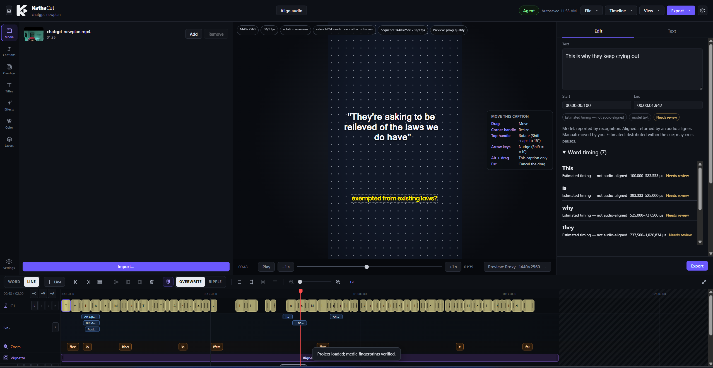
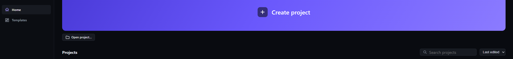

<div align="center">

# UPPELETE

**Your local AI video toolkit.** Automatic captions, animated subtitles and a real timeline, built for Malayalam and English creator videos. It runs on your computer.

[](LICENSE)


<a href="https://buymeacoffee.com/sadiqsulaimn"></a>

</div>

## What is UPPELETE?

UPPELETE turns a video into accurately timed, styled, animated captions and lets you polish the whole thing in one editor. It was built for Malayalam speech mixed with English technical terms, so Malayalam text is shaped correctly and never split inside a character cluster. Vertical 9:16 and landscape videos are both supported.

The core workflow is **local and offline** once you have downloaded a speech model. There is no account, no telemetry and no subscription, and your media is never uploaded unless you choose a cloud provider yourself.

<p align="center">
  
</p>

## Features

**Transcription**
- Automatic transcription of the video's own audio with local [whisper.cpp](https://github.com/ggml-org/whisper.cpp) models, including Malayalam. Models are downloaded on request, checksum-verified and removable.
- Optional cloud transcription with your own API key (Gemini, OpenAI, ElevenLabs Scribe). Only speech sections are uploaded, and you are told before anything leaves your computer.
- Optional translation of the recognized text, and optional audio alignment for imported subtitles.
- Word timing always says where it came from. Estimated timing is never passed off as aligned timing.

**Captions**
- Import SRT files without changing their text or timings. Export SRT any time.
- Caption styles with word-level animation (active-word highlight, pop, phrase fade, progressive reveal), custom fonts, colors, outline, shadow and background.
- Your corrections are authoritative: retranscribing never silently overwrites them.

**Editing**
- Multi-track timeline with several videos, linked audio, split, trim, ripple, picture-in-picture and undo/redo.
- Titles, image overlays, shapes, masks, zoom and blur regions, look adjustments and glass-style templates.
- Autosave, atomic project files (`.cstudio`) and relinking when media moves.

**Export**
- MP4 with captions burned in, using the same layout and animation code as the preview.
- Separate SRT export and a fully editable project file. Your source media is never overwritten.

**Optional local AI control**
- An off-by-default, loopback-only [MCP server](docs/MCP.md) lets a local Claude client inspect and edit the open project through the same undoable commands as the UI.

<p align="center">
  
</p>

## Privacy

- Transcription, editing and export run locally.
- Nothing is sent anywhere unless **you** enable a cloud provider, and then only what the dialog says it will send.
- API keys are stored with the operating system's secure storage and never reach the UI layer.
- No telemetry, accounts or ads.

## Install

Test installers for Windows (x64) and macOS (Apple Silicon) are attached to the [Releases](../../releases) page. They are **unsigned**, so Windows SmartScreen and macOS Gatekeeper will warn you the first time; [INSTALL_TESTERS.md](docs/INSTALL_TESTERS.md) explains how to proceed. Intel Macs are not supported.

## Build from source

Requires Node.js 22.12 or newer.

```sh
./dev.sh              # macOS: installs dependencies, sets up tools, runs Vite + Electron with hot reload
.\dev.ps1             # Windows (PowerShell): the same, and it finds or downloads FFmpeg and whisper-cli
npm run check         # typecheck, tests and production build
npm run dist:win      # build the Windows installer
npm run dist:mac      # build the macOS installer
```

The dev scripts save tool paths to the git-ignored `caption-studio.local.json`. The app never downloads engines or searches PATH by itself. See [media worker](docs/MEDIA_WORKER.md) and [dependencies](docs/DEPENDENCIES.md). If scripts are blocked on Windows, run `powershell -ExecutionPolicy Bypass -File .\dev.ps1`.

## Documentation

| Topic | Doc |
| --- | --- |
| Product requirements | [PRODUCT.md](docs/PRODUCT.md) |
| Architecture | [ARCHITECTURE.md](docs/ARCHITECTURE.md) |
| Roadmap and current status | [ROADMAP.md](docs/ROADMAP.md), [STATUS.md](docs/STATUS.md) |
| Timeline editing | [EDITING.md](docs/EDITING.md) |
| Transcription and models | [TRANSCRIPTION.md](docs/TRANSCRIPTION.md), [MODELS.md](docs/MODELS.md) |
| Caption rendering | [CAPTION_RENDERER.md](docs/CAPTION_RENDERER.md) |
| Media worker and FFmpeg | [MEDIA_WORKER.md](docs/MEDIA_WORKER.md) |
| Local agent control | [MCP.md](docs/MCP.md) |
| Licenses of dependencies | [DEPENDENCIES.md](docs/DEPENDENCIES.md), [THIRD_PARTY_NOTICES.txt](THIRD_PARTY_NOTICES.txt) |
| Design decisions | [docs/decisions/](docs/decisions/) |

## Project status

KathaCut is **pre-1.0** and under active development. It is developed on macOS (Apple Silicon) and Windows (x64 with an NVIDIA GPU); Linux is not supported yet. Some recent features have been type-checked but not yet exercised on every platform, and [STATUS.md](docs/STATUS.md) records exactly what has and has not been verified.

## ☕ Support the project

<p align="center">
  <b>KathaCut is free, open source, and built by one person.</b><br>
  No ads, no accounts, no paywalled features.<br><br>
  If it saved you an hour of caption fixing, a coffee helps me keep building it: better Malayalam support, more effects, more platforms.<br><br>
  <a href="https://buymeacoffee.com/sadiqsulaimn">
    
  </a>
</p>

Can't chip in? Starring the repo, sharing it with a creator friend, testing it on your hardware and reporting Malayalam rendering problems help just as much. 💜

## Contributing

Contributions are welcome. Please read [CONTRIBUTING.md](CONTRIBUTING.md) first.

## License

KathaCut is licensed under the [GNU General Public License v3.0 or later](LICENSE). The name and logo are covered separately by [TRADEMARKS.md](TRADEMARKS.md). Bundled third-party components and their licenses are listed in [THIRD_PARTY_NOTICES.txt](THIRD_PARTY_NOTICES.txt).
